[//]: # (Image References)

[image1]: ./pictures/requirements.png "img1"
[image2]: ./pictures/spacy_model.png "img2"
[image3]: ./pictures/install.png "img3"
[image4]: ./pictures/npm.png "img4"
[image5]: ./pictures/pythoninterpreter.png "img5"
[image6]: ./pictures/pythonintworkspace.png "img6"
[image7]: ./pictures/pythoninterpretananconda.png "img7"
[image8]: ./pictures/generation_content.png "img8"
[image9]: ./pictures/generation_data.png "img9"
[image10]: ./pictures/generation_result.png "img10"
[image11]: ./pictures/trainingnlu_content.png "img11"
[image12]: ./pictures/trainingnlu_config.png "img12"
[image13]: ./pictures/trainingnlu_response.png "img13"
[image14]: ./pictures/trainingnlu_result.png "img14"
[image15]: ./pictures/trainingnlu_testcase_result.png "img15"
[image16]: ./pictures/trainingva_content.png "img16"
[image17]: ./pictures/trainingva_generate_result.png "img17"
[image18]: ./pictures/va_training.png "img18"
[image19]: ./pictures/va_training_end.png "img19"
[image20]: ./pictures/trainingva_result.png "img20"
[image21]: ./pictures/running_web.png "img21"
[image22]: ./pictures/running_index.png "img22"
[image23]: ./pictures/running_chat.png "img23"
[image24]: ./pictures/intent_trainer.png "img24"

# Getting started 

Follow the instructions to install the required libraries and tools:

1.	Install Python 3 with Anaconda https://www.anaconda.com/download/ and make sure you set python on node home variables.
    Include the paths for Anaconda and pip into the environment variables path to ease working with python.
 
2.	Download and install npm and node from https://nodejs.org/en/download/

3.  Install Visual Studio Code for Windows https://www.visualstudio.com/, if you don't have it already as you will require C++ compilers. 

4.	Download this repository and open the solution in VSCode

5.  Click ctrl+shift+P, to select interpreter. Type 'Python: Select Interpreter' and choose the right Anaconda Version.

    

        
    

    

        
    

    

        
    

    

6.  This repo contains a requirements.txt file which we will use to install the dependencies. Install the dependencies by navigating to the main folder and executing:

        **pip install -r requirements.txt**

	- The installation should run without the errors. A successful installation should be indicated by a message that the list of  dependencies was successfully installed:

    

        
    

7.	Install spacy model by running:

	    **python -m spacy download en**

	*Note: If installation throws an error, run the terminal as an administrator and rerun the command.*

	After the successful installation you should see a similar output in your console:

    

        
    

8.	Install rasa_core by running:

	    **pip install rasa_core**
	
	The installation should be completed without any errors and it should end with a message saying that the libraries were successfully installed.	

9. As a sanity check, at this step you can launch your python interpreter and import rasa_nlu, rasa_core, apixu, spacy libraries as well as spacy model. If it doesn't throw you any errors, it means that everything was installed successfully.
	
	In your console type the following:
	
        **python** *(to launch the Python interpreter)*  
        **import rasa_nlu**  
        **import rasa_core**  
        **import spacy**  
        **nlp = spacy.load('en')**
	  
	If everything was installed successfully, you should see the following in your console:

    

        
    

	
8.	Install rasa_nlu data visualisation tool by executing:

	**npm i -g rasa-nlu-trainer**

	A successful installation should result in a similar message in your console:

    

    
    

	
# Now thats complete lets walkthrough the code..

9. Install rasa_nlu data visualisation tool by executing:

    Go to cd virtualassistantweb directory

         **python apiserver.py**

    Then open a new terminal and go to the web directory
    
        **python -m http.server 8000**

# Let's start chatting!

10. Once the 'apiserver.py' is running, navigate to http://localhost:8000

    

        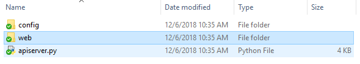
    

    

        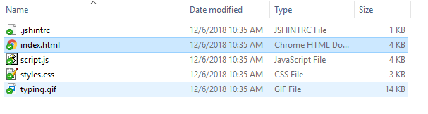
    

11. Click on the 'mail' picture on the bottom right and start chatting!

    

        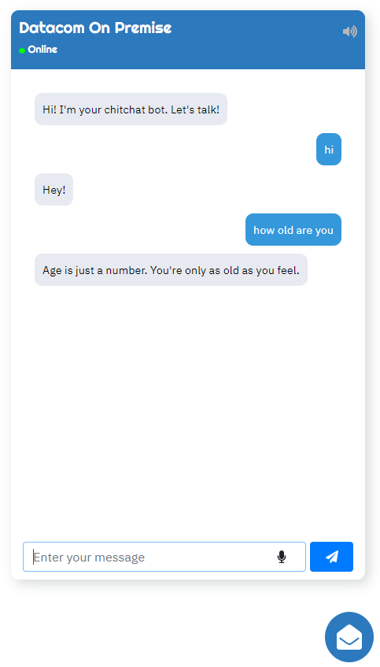
    

# How to train your bot

## Utterance Generation:

1. The 'generation' folder contains the following files:
    

        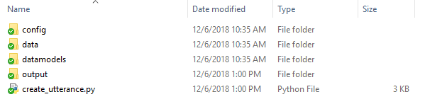
    

2. Place your training file in the ‘data’ folder. Place any ‘stopwords’ to filter out from the results if needed.
    

        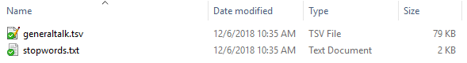
    

3. Navigate to the folder and run the following codes to generate intents and utterance.

        **python .\create_utterance.py**

4. The intents and utterances file should be generated in the output folder or wherever the path is set on config.
    

        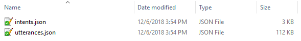
    

5. Want to manage you utterances visually we have covered, run this in the output folder, then go to http://localhost:8888
    
     **rasa-nlu-trainer --s utterances.json --p 8888**
    
    

        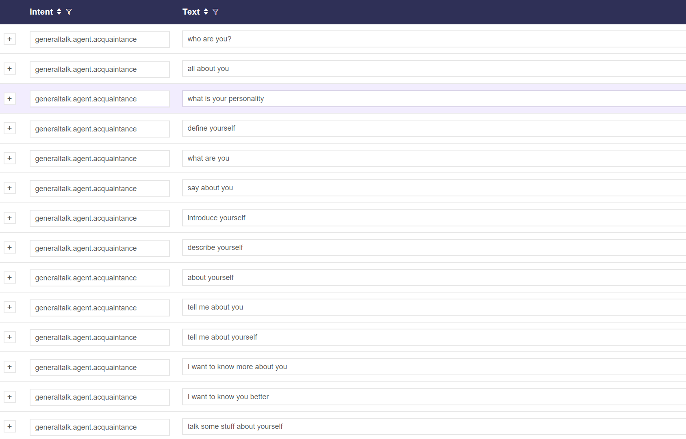
    

## Natural Language Understanding (NLU) Training:

1. The 'trainingnlu' folder contains the following files:
    

        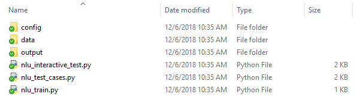
    

2. Make sure your utterances path is set to the correct path in the 'config/config_spacy.yml' file on ‘data’.
    

        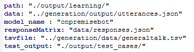
    

3. Train your utterances by running the 'nlu_train.py' script at the trainingnlu folder.

        **python .\nlu_train.py**

4. The following message will be shown once the training is completed.
    

        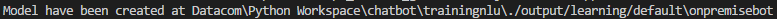
    

5. The results from the training can be found at the path mentioned above.
    

        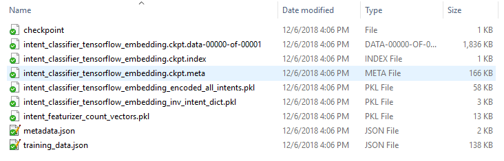
    

6. To run test cases, run the test case script with the following command.

        **python .\nlu_test_cases.py**

7. The results will be generated into the 'output/test_cases' folder.
    

        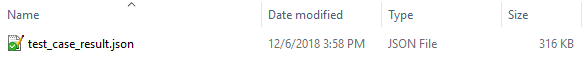
    

## Virtual Assistant (VA) Dialogue Training:

1. The 'trainingvadailogue' file contains the following files:
    

        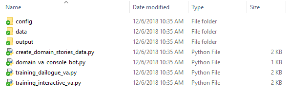
    

2. Create domain and stories by running the 'create_domain_stories_data.py' script.

        **python .\create_domain_stories_data.py**

3. The following files will be generated in the ‘data’ folder.
    

        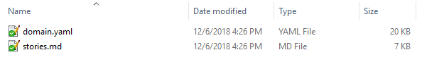
    

4. Run the following script to train the data.
        
        **python .\create_domain_stories_data.py**

5. During the training, the following outputs can be seen.
    

        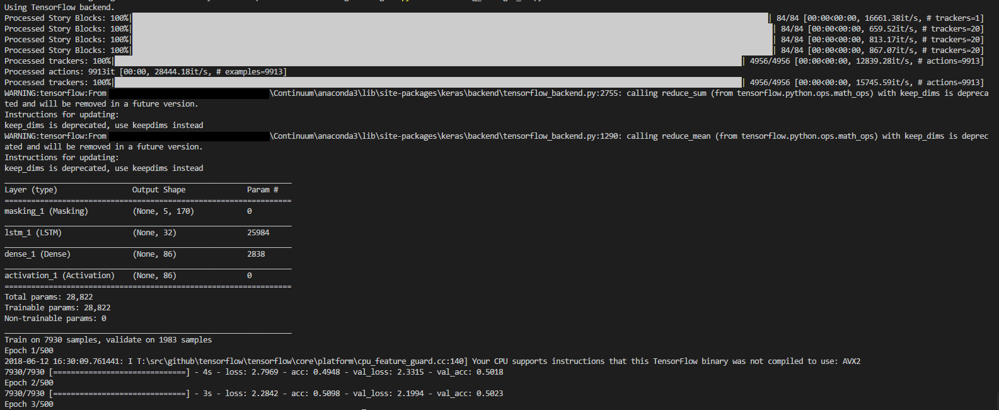
    

6. Let the training run until it is completed. (500/500 in this case)
    

        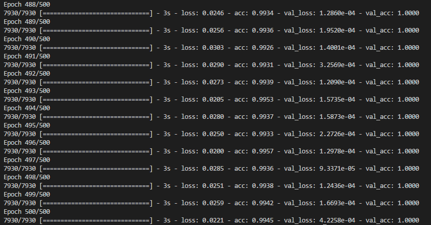
    

7. Once the training has completed, the results can be found in the output folder.
    

        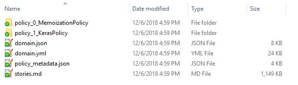
    

# Contents

generation:
-----------
1. create_utterance.py - Python script to generate intents and utterances
2. config\generation_config.yaml - Contains the paths to read from and generate intents/utterances file
3. datamodels\\* - Rasa NLU datamodels scripts
4. data\generaltalk.tsv - Contains list of conversations with intents and source
5. data\stopwords.txt - Contains list of words that should be filtered out during utterances generation
                        (Disabled at default)
6. output\intents.json - Contains the intents that can be recognized generated from generaltalk.tsv
7. output\utterances.json - Possible questions/texts from users/agents generated from generaltalk.tsv

trainingnlu:
------------
1. nlu_train.py - Python script to train data in 'generation\output\utterances.json'
2. nlu_interactive_test.py - Python script to perform interactive testing.
                             (*Remember to set the correct path of responseMatrix to responses.json in config_spacy.yml*)
3. nlu_test_cases.py - Python script to perform test cases
                       (*Remember to set the correct path of tsvfile to generaltalk.tsv in config_spacy.yml*)
4. config\config_spacy.yml - Contains training configurations and file paths
5. data\responses.json - Contains responses by intent
6. output\learning\\* - Contains metadata and training/test case data from training
7. output\test_cases\test_case_result.json - Contains test case results with confidence level in json format

trainingvadailogue:
-------------------
1. create_domain_stories_data.py - Python script to generate domain and stories
2. training_dailogue_va.py - Python script to train stories
3. training_interactive_va.py - Python script to train response with input whether the response is correct
4. domain_va_console_bot.py - Python script to run the bot on console
5. config\training_va_config.yaml - Contains paths to data file paths
6. data\domain.yaml - Contains responses with ID for mapping
7. data\stories.md - Contains the mapping of intents and responses from domain.yaml
8. output\\* - Contains domain and stories generated from training

virtualassistantweb:
--------------------
1. apiserver.py - Python script to run bot on server(localhost in this case)
2. config\va__web_config.yaml - Configuration path to va and nlu training results
3. web\\* - Contains the chatbot interface and scripts