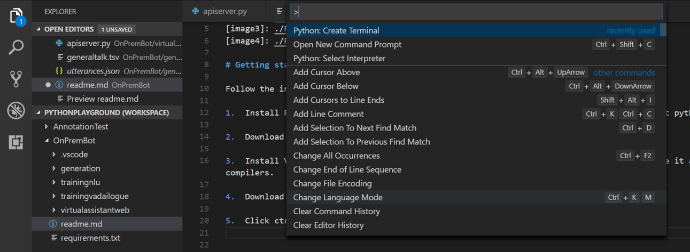
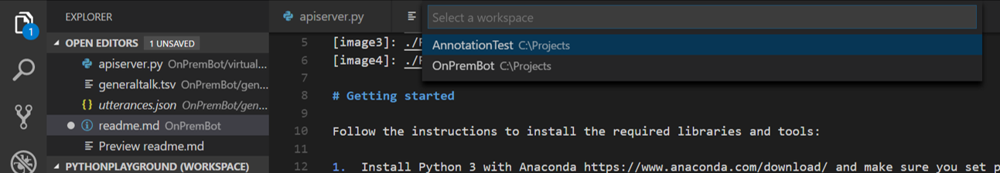
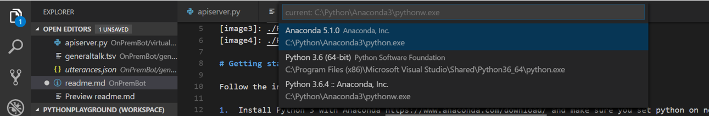
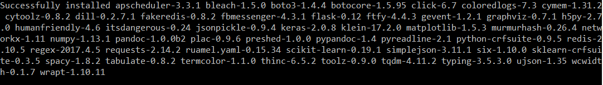
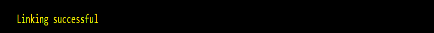
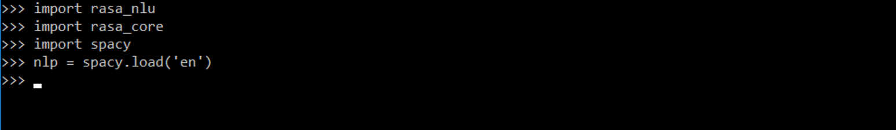
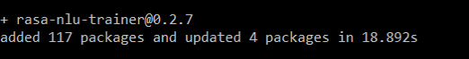

[//]: # (Image References)

[image1]: ./pictures/requirements.png "img1"
[image2]: ./pictures/spacy_model.png "img2"
[image3]: ./pictures/install.png "img3"
[image4]: ./pictures/npm.png "img4"
[image5]: ./pictures/pythoninterpreter.png "img5"
[image6]: ./pictures/pythonintworkspace.png "img6"
[image7]: ./pictures/pythoninterpretananconda.png "img7"

# Getting started 

Follow the instructions to install the required libraries and tools:

1.	Install Python 3 with Anaconda https://www.anaconda.com/download/ and make sure you set python on node home variables
 
2.	Download and install npm and node from https://nodejs.org/en/download/

3.  Install Visual Studio Code for Windows https://www.visualstudio.com/, if you don't have it already as you will require C++ compilers. 

4.	Download this repository and open the solution in VSCode

5.  Click ctrl+shift+P, to select interpreter

    

        
    

    

        
    

    

        
    

    

6.  This repo contains a requirements.txt file which we will use to install the dependencies. Install the dependencies by executing:

        **pip install -r requirements.txt**

	- The installation should run without the errors. A successful installation should be indicated by a message that the list of  dependencies was successfully installed:

    

        
    

7.	Install spacy model by running:

	    **python -m spacy download en**

	*Note: If installation throws an error, run the terminal as an administrator and rerun the command.*

	After the successful installation you should see a similar output in your console:

    

        
    

8.	Install rasa_core by running:

	    **pip install rasa_core**
	
	The installation should be completed without any errors and it should end with a message saying that the libraries were successfully installed.	

9. As a sanity check, at this step you can launch your python interpreter and import rasa_nlu, rasa_core, apixu, spacy libraries as well as spacy model. If it doesn't throw you any errors, it means that everything was installed successfully.
	
	In your console type the following:
	
        **python** *(to launch the Python interpreter)*  
        **import rasa_nlu**  
        **import rasa_core**  
        **import spacy**  
        **nlp = spacy.load('en')**
	  
	If everything was installed successfully, you should see the following in your console:

    

        
    

	
8.	Install rasa_nlu data visualisation tool by executing:

	**npm i -g rasa-nlu-trainer**

	A successful installation should result in a similar message in your console:

    

    
    

	
# Now thats complete lets walkthrough the code..

9. Install rasa_nlu data visualisation tool by executing:

       **python apiserver.py**
       **python -m http.server 8000**
       **rasa-nlu-trainer --s utterances.json --p 8888**